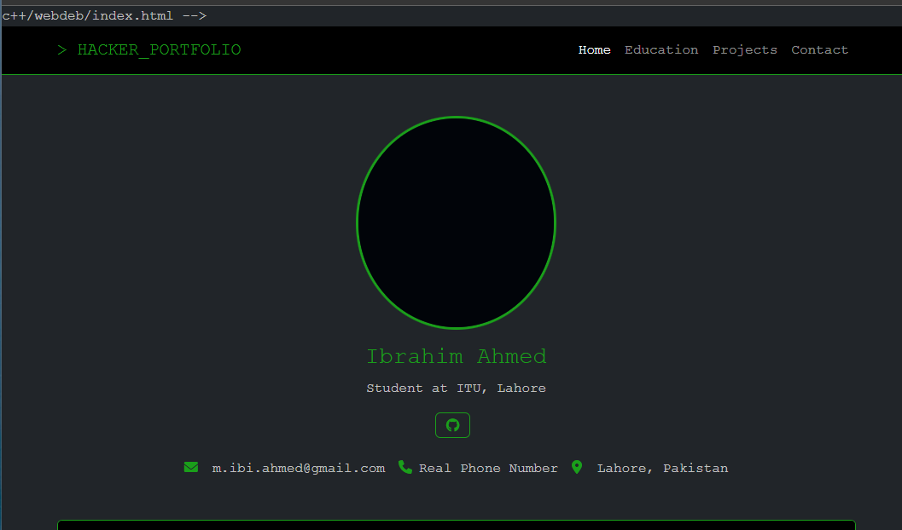

# Terminal Portfolio

A personal portfolio website with a hacker-inspired terminal aesthetic, built using HTML, CSS, and Bootstrap 5.

##  [Live Demo](https://m-ibi.github.io/portfolio-2025/)

##  Overview

This portfolio website showcases my skills, education, projects, and contact information with a distinctive hacker/terminal style featuring a dark theme with neon green accents. The interface mimics a command-line environment while maintaining modern web design principles.

##  Features

- **Terminal-Inspired UI** - Typical inaccurate movie hacker theme 